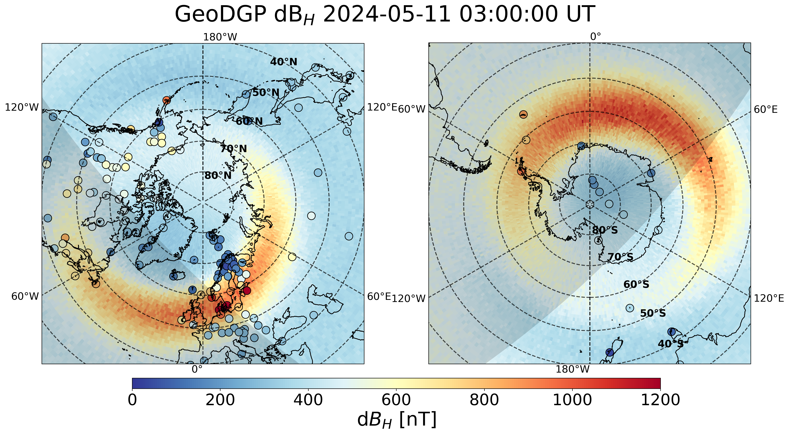

# Project Title

GeoDGP is a data-driven model that probabilistically forecasts local geomagnetic perturbation over the globe at 1-minute cadence 1-hour ahead.

## Project Structure

```
your_project/
├── data/               # this can be downloaded from Deep Blue Data
├── figure/             # this can be downloaded from Deep Blue Data
├── scripts/            # scripts to reproduce results in the paper
├── src/                # Source code
├── requirements.txt    # Python dependencies
└── README.md
```

## Getting Started

### 1. Clone the repository

```bash
git clone https://github.com/HongfanChen/GeoDGP.git
cd your-repo
```

### 2. Set up a virtual environment (recommended)

\`\`\`bash
python -m venv venv
source venv/bin/activate  # On Windows: venv\Scripts\activate
\`\`\`

### 3. Install dependencies

\`\`\`bash
pip install -r requirements.txt
\`\`\`

## Features

- Feature 1: ...
- Feature 2: ...
- Model: Deep Gaussian Process for time series prediction

## Example Outputs

Include sample plots, tables, or results (optional):



## License

This project is licensed under the MIT License - see the [LICENSE](LICENSE) file for details.

## Citation

